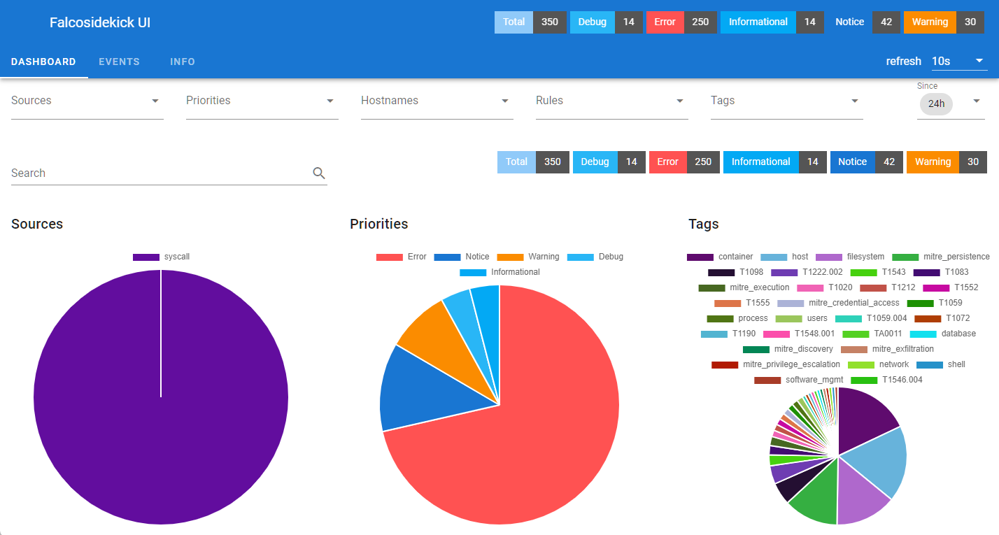
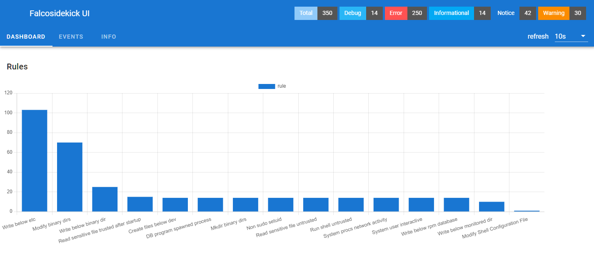
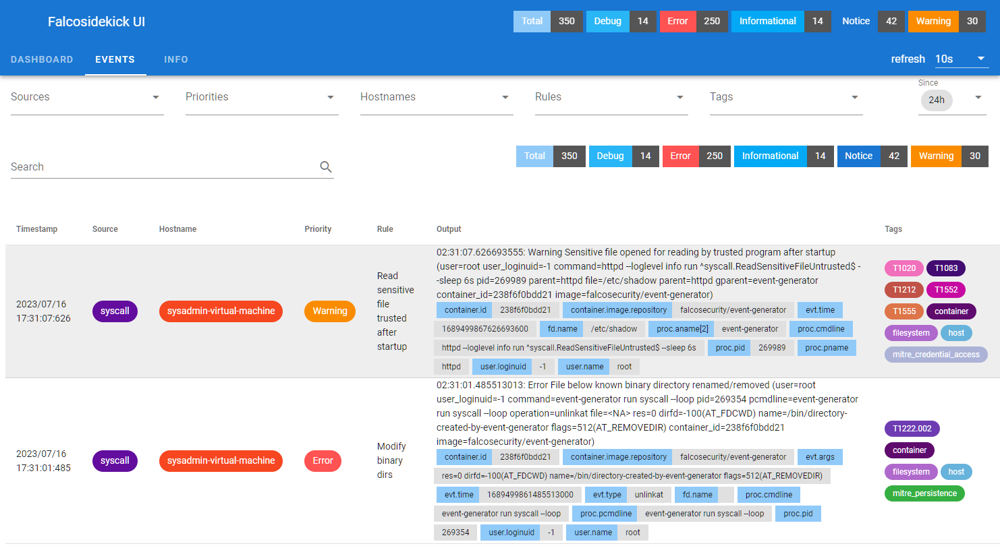

## Falco 快速安装

[Falco](https://falco.org/) | [falcosecurity/falco: Cloud Native Runtime Security (github.com)](https://github.com/falcosecurity/falco)

```bash
#  Tested on an Ubuntu 20.04
- https://falco.org/docs/getting-started/try-falco/try-falco-on-ubuntu/

# Add Falco repository.
curl -fsSL https://falco.org/repo/falcosecurity-packages.asc | \
  sudo gpg --dearmor -o /usr/share/keyrings/falco-archive-keyring.gpg
sudo cat >/etc/apt/sources.list.d/falcosecurity.list <<EOF
deb [signed-by=/usr/share/keyrings/falco-archive-keyring.gpg] https://download.falco.org/packages/deb stable main
EOF
sudo apt-get update -y

# Install kernel headers
sudo apt-get install -y dkms make linux-headers-$(uname -r)
sudo apt-get install -y dialog

# Install the package falco and its dependencies
sudo apt-get install -y falco

# Verify the Falco installation
sudo systemctl status falco

# Simulate a suspicious event:
sudo cat /etc/shadow > /dev/null

# Via journalctl
sudo journalctl _COMM=falco -p warning

# Via /var/log/syslog
sudo grep falco /var/log/syslog
```


### Falco 配置文件

```bash /etc/falco/falco.yaml
# /etc/falco/falco.yaml

# 输出到文件，方便测试
file_output:
  enabled: true
  keep_alive: false
  filename: /var/log/events.txt
```


### Falco 相关环境测试

```bash
# 检查存在 Falco 主机防护
/usr/bin/falco
/usr/bin/falcoctl
/usr/bin/falco-driver-loader
/etc/systemd/system/falco.service
/etc/falco/falco.yaml
/dev/falco0

# 检查 Falco 系统服务
systemctl list-units | grep falco
systemctl status falco
ls -l /usr/lib/systemd/system/falco*
  > falco-bpf.service
  > falcoctl-artifact-follow.service
  > falco-custom.service
  > falco-kmod-inject.service
  > falco-kmod.service
  > falco-modern-bpf.service

# 检查 Falco 安装包
apt show falco
  > Package: falco
  > Version: 0.35.1

# 测试杀死进程，会重新复活
ps aux | grep falco
sudo kill -9 PID

# 测试使用 systemctl 能够关闭防护
systemctl stop falco
  - 备注：需要 root 权限
  - 关闭后不记录日志，服务重新时会产生一条重启日志

# 绕过测试
创建一个系统服务，不会告警
sudo nano /lib/systemd/system/shellscript.service 
[Unit]
Description=My Shell Script
[Service]
ExecStart=/usr/bin/script.sh
[Install]
WantedBy=multi-user.target

sudo systemctl daemon-reload 
sudo systemctl enable shellscript.service 
sudo systemctl start shellscript.service 

# Rules 规则分析
  Create files below dev # 不要在 /dev 创建文件
  DB program spawned process
  Mkdir binary dirs # 不要修改 二进制文件
  Modify binary dirs # 不要修改 二进制目录
  Modify Shell Configuration File # 不要修改 Shell 文件
  Non sudo setuid
  Read sensitive file trusted after startup
  Read sensitive file untrusted
  Run shell untrusted
  System procs network activity # 记录所有网络活动
  System user interactive
  Write below binary dir
  Write below etc # 不要需改 /etc 
  Write below monitored dir
  Write below rpm database
```


## Falcosidekick 快速安装

```bash
# Tested on an Ubuntu 20.04 
https://falco.org/docs/getting-started/try-falco/try-falcosidekick-on-ubuntu/

# Install a Container Runtime
sudo apt install -y docker.io

# Create a instance of Redis
sudo docker run --detach --rm --network=host \
--name redis docker.io/redis/redis-stack-server:latest

# Start a Falcosidekick container
sudo docker run --detach --rm --network=host \
--env WEBUI_URL=http://localhost:2802 \
--name falcosidekick falcosecurity/falcosidekick:2.27.0

# Check Falcosidekick output
sudo docker logs falcosidekick
2023/07/16 09:13:01 [INFO]  : Falco Sidekick version: 2.27.0
2023/07/16 09:13:01 [INFO]  : Enabled Outputs : [WebUI]
2023/07/16 09:13:01 [INFO]  : Falco Sidekick is up and listening on :2801

# Start Falcosidekick UI
sudo docker run --detach --rm --network=host \
--name falcosidekick-ui falcosecurity/falcosidekick-ui

# Check Falcosidekick UI output
sudo docker logs falcosidekick-ui
2023/07/16 09:17:15 [WARN] : Index does not exist
2023/07/16 09:17:15 [WARN] : Create Index
2023/07/16 09:17:15 [INFO] : Falcosidekick UI is listening on 0.0.0.0:2802
2023/07/16 09:17:15 [INFO] : log level is info

# Verify all containers are running
sudo docker ps
6bf43d19fe7e   falcosecurity/falcosidekick-ui
bcc7aa743beb   falcosecurity/falcosidekick:2.27.0
0dacd307fd91   redis/redis-stack-server:latest

# Redirect Falco output
# /etc/falco/falco.yaml
...
json_output: true
http_output:
  enabled: true
  url: http://localhost:2801
...

# Restart Falco to apply these changes:
sudo systemctl restart falco

# Generate a suspicious event
sudo cat /etc/shadow > /dev/null


# Access the Falcosidekick UI Dashboard
http://localhost:2802/dashboard


# Event Generator
sudo docker run -it --rm falcosecurity/event-generator \
run syscall --loop


```


### UI 界面

默认配置：http://192.168.x.x:2802/ admin admin



规则



日志


