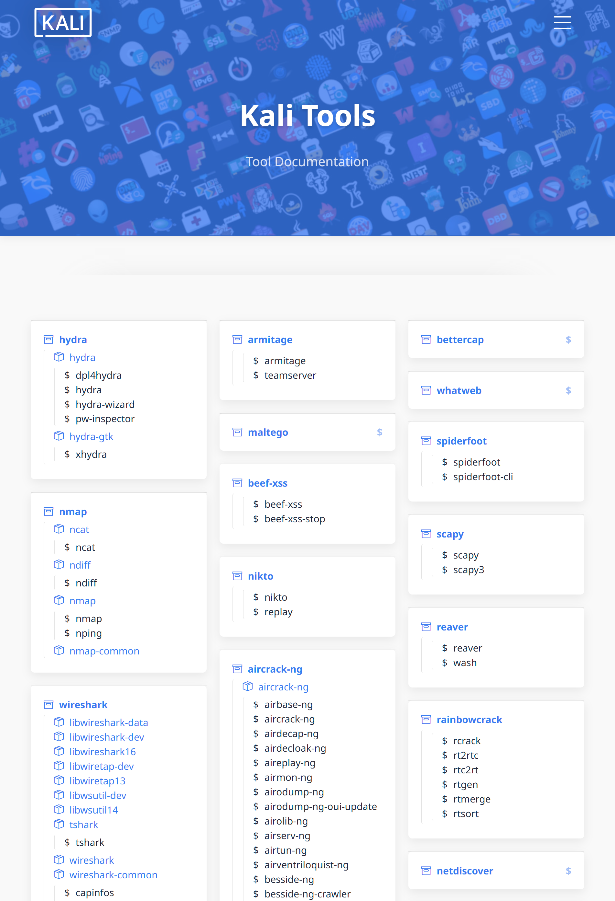
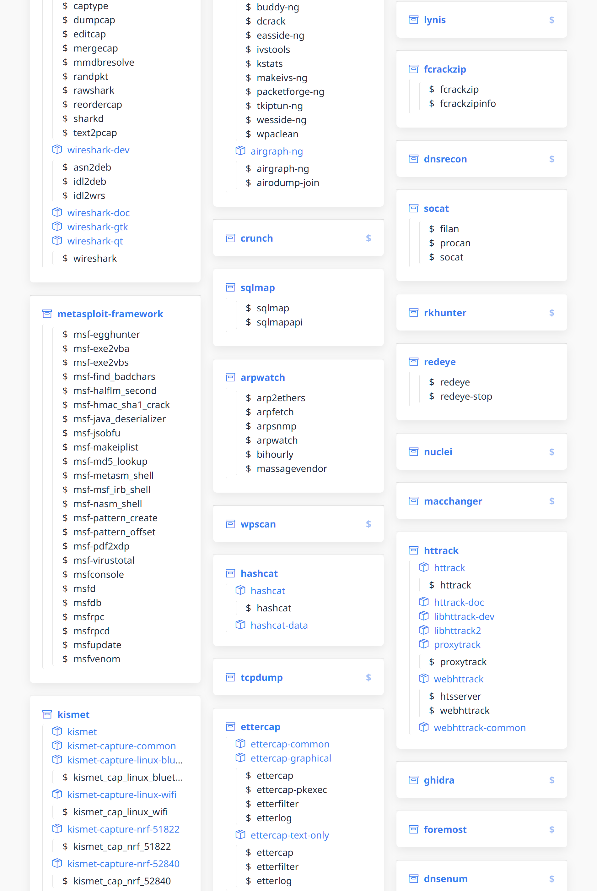
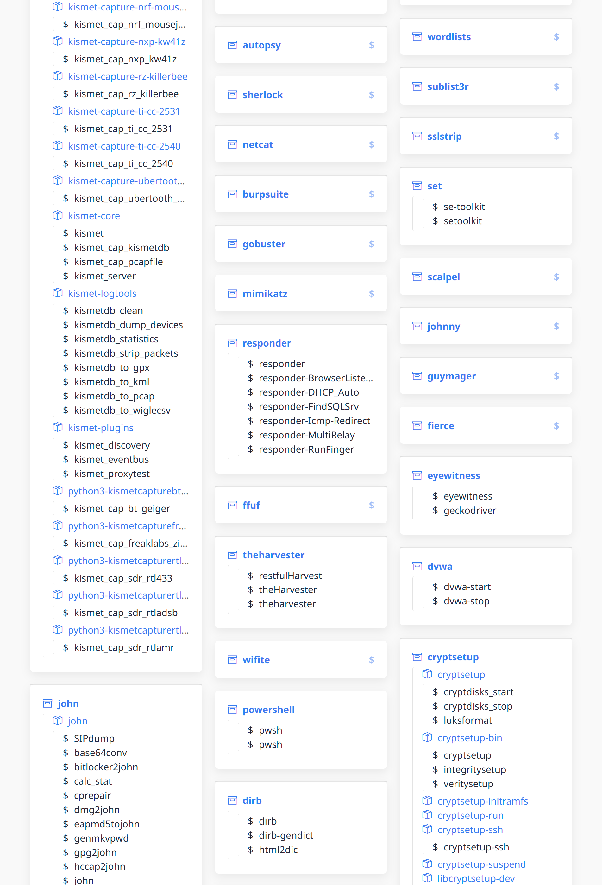
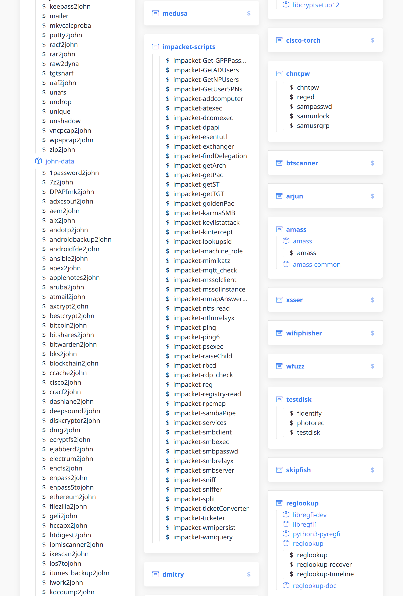
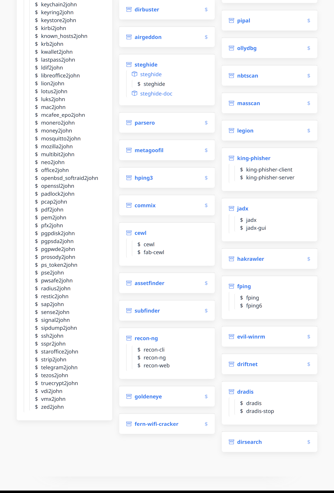

黑客的秘密武器100顶级渗透神器汇总

- Metasploit：世界领先的渗透测试工具，拥有强大的漏洞利用库和自定义脚本功能，助您迅速发现并利用目标系统的安全漏洞。
- Burp Suite：专业的Web应用程序渗透测试平台，提供代理、扫描和攻击等功能，帮助您检测和利用Web应用程序中的漏洞。
- Aircrack-ng：用于无线网络渗透测试的完整套件，包括无线网卡驱动程序、嗅探器和WEP/WPA破解工具，可实现WiFi网络的渗透和安全审计。
- John the Ripper：强大的密码破解工具，支持多种加密算法，可用于恢复失去的密码或评估弱密码的安全性。
- Hydra：快速且灵活的登录破解工具，支持多种协议和服务，可用于暴力破解密码或进行在线身份验证测试。
- Nikto：开源的Web服务器扫描工具，能够识别常见的安全风险和漏洞，帮助您评估Web应用程序的安全性。
- SQLMap：专为SQL注入攻击设计的自动化工具，可检测和利用Web应用程序中的SQL注入漏洞，从而获取数据库敏感信息。
- Wireshark：最受欢迎的网络协议分析工具，可实时捕获和分析网络流量，帮助您深入了解网络通信并发现潜在的安全问题。
- Maltego：强大的开源情报收集和数据分析工具，可在互联网上收集和分析各种信息，并帮助您构建威胁情报画像。
- Social Engineer Toolkit（SET）：专为社会工程学攻击设计的框架，提供多种伪装和钓鱼攻击模块，可用于测试人员的安全意识和训练。
- #Kali #网络安全 #渗透测试 #黑客工具 #漏洞扫描 #密码破解 #社会工程学

