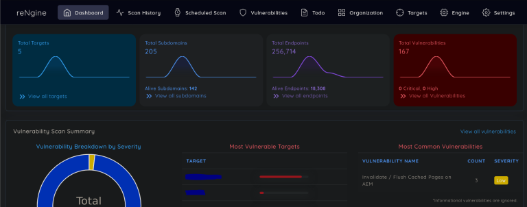
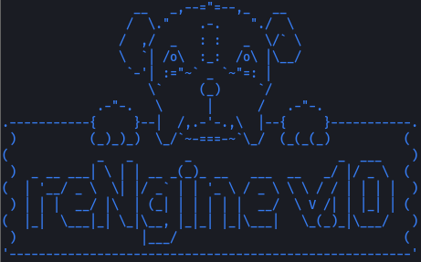
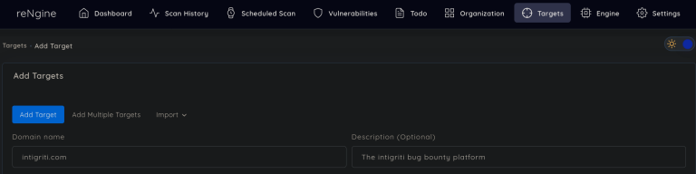
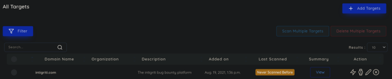
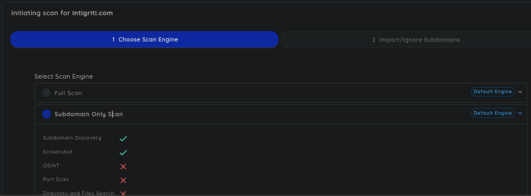
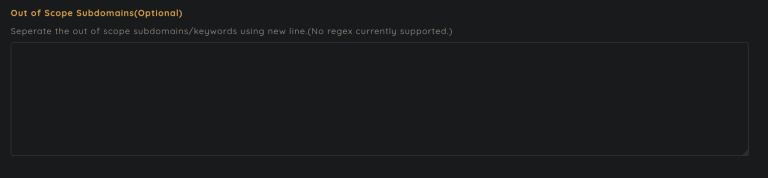
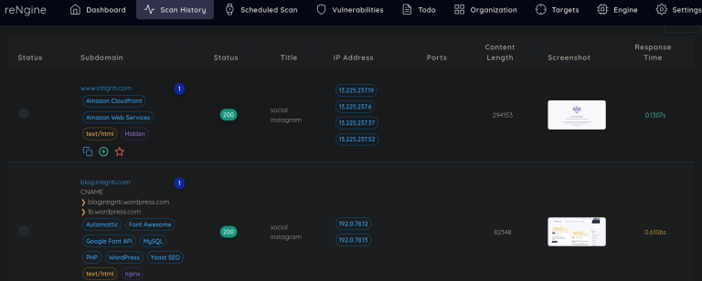

## ReNgine – 自动侦察

每次开始我们的安全扫描和侦察，都要了解目标托管在哪里，运行的是什么服务，开放的端口等等。手动完成这些操作可能非常耗时，更不用说组织所有这些数据的痛苦了。幸运的是，ReNgine 能够帮助我们做到了所有这些。让我们来看看这个神奇的工具！

## ReNgine 是什么？

ReNgine是一个针对Web应用程序的自动侦察工具，让您更轻松地发现漏洞和安全问题。它帮助您建立攻击路径或简化整个侦察过程，让您的工作更高效。

* 引擎驱动：ReNgine 可以执行各种任务引擎，比如查找子域名、漏洞扫描等，帮助您发现潜在的弱点和漏洞。
* 数据管理与备份：所有收集到的数据都会被整理并备份到数据库中，您可以随时访问之前的扫描结果，轻松对比和分析数据。
* 持续监控：您可以设置定期扫描来持续监控目标。ReNgine 会自动检测目标基础设施的变化，并及时提醒您。这样，您就可以快速了解新出现的漏洞和风险。
* 用户界面友好：ReNgine 提供了一个易于使用的用户界面(UI)，让您可以直接与数据进行交互，轻松地查看和分析所有关键信息。

## ReNgine 部署

1.下载代码库，到新创建的目录中：

`git clone https://github.com/yogeshojha/rengine && cd rengine`

2.编辑环境文件：

`nano .env`

<small>请注意修改 postgresql 的默认密码。</small>

3.运行初始化脚本：

`sudo ./install.sh`

<small>该脚本将安装、设置并启动 ReNgine 运行所需的所有 docker 容器。</small>

<small>安装完成后，程序会提示输入用户名和密码，需要用它来登录管理后台。</small>

4.前往 https://127.0.0.1 访问管理后台！

## 我们的第一次扫描

让我们进行第一次扫描！

** 第 1 步：创建目标 **

转到目标选项卡并添加新目标。输入域名和描述（如果需要）。

这将使您看到以下视图，您可以在其中清楚地看到我们以前从未扫描过该目标。让我们改变这一点！

** 第 2 步：执行第一次扫描 **

单击目标旁边的闪电图标以启动扫描。您将被重定向到一个页面，您可以在其中选择要在目标上运行的引擎。在本例中，我想执行子域扫描，因此我选择了该扫描。

我没有时间深入介绍每一个功能，但是这个功能真的非常非常酷。子域是否超出范围？不用担心，只要在这里列出它们就不会被扫描！

** 第 3 步：评估结果 **

扫描完成后，您可以查看所有结果。请注意，在本例中，我只运行了子域扫描，但是该工具可以做更多事情！

## ReNgine 更多功能

ReNgine 提供的更多功能

* 端口发现
* 端点发现
* 目录爆破
* 使用 Nuclei 进行漏洞扫描
* 并行扫描
* 数据可视化
* 可配置的扫描引擎
* 开源情报能力
* 对即时通讯工具发出警报
* 待办事项清单
* 代理支持

如需更详细的解释，请查看 GitHub ：https://github.com/yogeshojha/rengine
