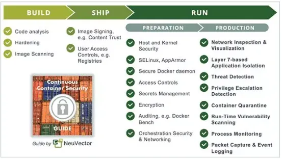
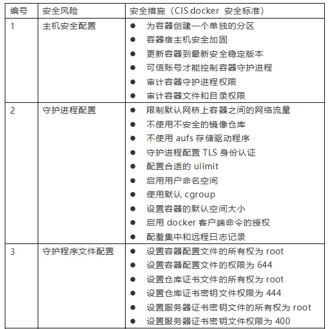
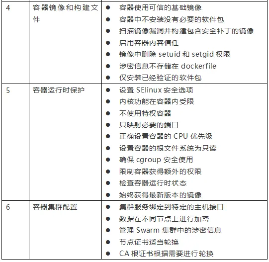

随着云服务的快速发展，容器的使用日益普及，容器安全问题日益凸显。为了规范和指导容器的安全使用，今天向大家介绍在容器使用过程存在安全问题，并针对这些问题提供了针对性对策建议。

## 一、容器安全主要风险 

NIST.SP.800-190 容器安全指南列出了需要采取安全措施的五个方面，包括镜像、镜像仓库、编排工具、容器和主机操作系统。

镜像风险：有可能是镜像漏洞、镜像配置缺陷、嵌入式恶意软件、未被信任的镜像、明文存储的秘钥。

镜像仓库风险：包括与镜像仓库的连接不安全、镜像仓库中的镜像过时和不完备的认证授权机制，这些都会给镜像仓库带来风险。

编排工具风险：包括管理访问权限不受限制、未经授权的访问、容器间网络流量隔离效果差、混合不同敏感度级别的工作负载、编排工具节点可信。

容器风险：包括运行时软件中的漏洞、容器的网络访问不受限制、容器运行时配置不安全、应用漏洞、流氓容器。

主机操作系统风险：主要包括攻击面大、共享内核、主机操作系统组件漏洞、用户访问权限不当、篡改主机操作系统文件系统。

## 二、全生命周期的容器安全 

容器的安全防护应该覆盖整个容器的生命周期，即容器的构建、分发、运行三个阶段，这样才能确保持续的安全性。

### （1）容器构建安全性

由于容器中广泛使用开源软件，这增加了将漏洞引入应用程序的风险。应该在容器构建阶段扫描软件和 Docker 容器镜像，以发现漏洞，在解决问题之后再投入生产。因此，需要定期扫描镜像注册中心，以检测即将应用于生产中的容器镜像是否存在新发现的漏洞。

此外，容器构建通常都是单一功能，因此应该删除任何不必要的包、库和其他组件，对镜像进行精简、加固，减少容器攻击面。

### （2）容器分发安全性

运维团队需要确保不会在生产中使用未经授权的镜像。为了确保这一阶段的安全性，需要进行安全认证，比如镜像签名和访问控制。应对镜像仓库、编排工具等其他开发工具设置统一的访问控制策略。

### （3）容器运行安全性

运行时安全性是最重要的内容，因为在应用的整个生命周期内，容器将不断受到扫描和攻击。即使容器不断地启动、停止和更新，运行容器的主机也很容易受到新的攻击和零日攻击。

## 三、容器安全最佳实践 

