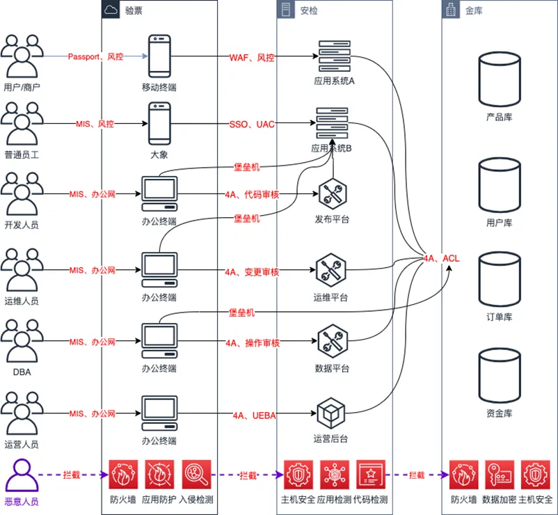
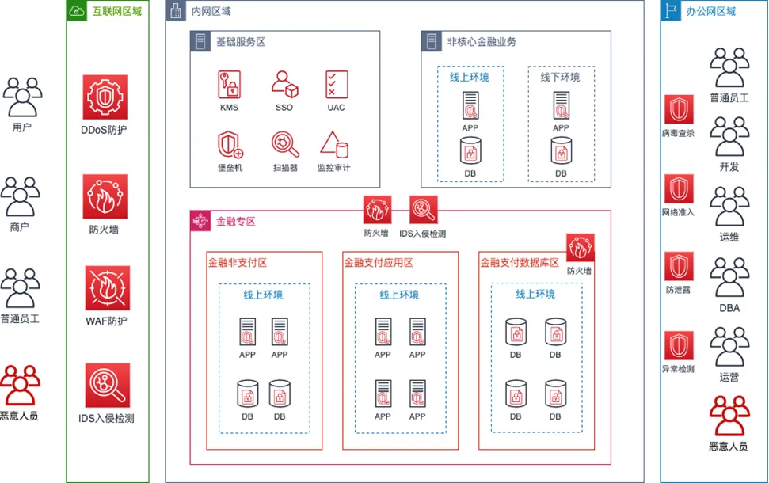

本文总结行业面临的安全风险和企业安全架构现状，并根据这些风险和威胁提出应对措施。

## 一、网络安全现状

**●**全球化网络威胁不断深化

通过互联网攻击手段实施企业犯罪活动已经成为企业犯罪的重要手段，企业组织机构也成为网络犯罪分子的首选目标。各种利用互联网攻击技术进行偷盗、诈骗、敲诈等案件不断发生，围绕互联网的黑灰产业正以极快的速度蔓延且在各国之间相互渗透。“网络黑产从业人员”呈级数增长，利用黑客技术的案件数每年以超过30%的增速增长，规模也已高达千亿级别。

**●**新技术带来更多安全挑战

云计算环境中多租户的东西向和南北向的隔离技术和虚拟化计算存储技术使得安全边界不断扩大。大数据成为核心资产的同时，数据泄露、滥用、丢失的问题更加严重。区块链、物联网（IoT）设备等新兴技术，随着爆出来的漏洞越多，安全问题越严峻。

**●**传统安全问题依然不容忽视

网络攻击流程化、普及化，黑客门槛不断降低，各类分析、扫描、破解、攻击工具可以随意下载，漏洞利用方式越发简易。企业每天都接受到大量的刺探性侵扰信息，一旦发现安全隐患，可能被不同类型恶意分子反复利用，对其造成不可估量的破坏性影响。

## 二、面临的网络安全威胁 

### 常见网络安全威胁 

系统脆弱性

●企业业务支撑系统存在安全漏洞，给病毒、DDOS、僵尸网络、蠕虫等侵入留下可乘之机，带来很大威胁；

●病毒木马的威胁，很多木马程序和密码嗅探程序等多种病毒不断更新换代对网上银行实施攻击，窃取用户信息，可以直接威胁网上银行安全，其用户上网终端如没有安装木马查杀工具，就很容易被染；

●移动企业信息风险，由于用户安全防范意识比较薄弱及很多软件存在安全隐患，可能会给用户造成损失；

外部攻击者

●黑客攻击由原来的单一无目的攻击转变成为有组织目的性很强的团体攻击犯罪，在攻击中主要以经济利益为目的，采取针对性的集团化攻击方式；

●最有效的网络互联网攻击形式是DDOS攻击，常见的有SYN攻击、DNS放大攻击和应用层DDOS攻击；

●网络钓鱼诱骗企业用户误认为钓鱼网站属于安全网站，很容易将用户信息泄露，虽然政府、企业对此非常重视，但很多钓鱼网站建在境外，很难监管；

内部因素

●因企业业务服务中信息系统与内部控制存在缺陷，也有不适当的操作和人工引发的信息安全风险。

管理制度策略

●企业的外包服务有可能给服务机构带来数据泄密的风险；

●信息泄露，企业交易信息是通过网络传输的，有些业务交易平台在信息传输、使用、存储、销毁等环节未建立保护信息的有效机制，致使信息很容易出现泄露风险；

### 典型大额资损安全事件 

●美国多家大银行泄露了2400多万份企业及银行资料，涉及大量贷款和抵押贷款信息；

●Lazarus黑客组织长期针对银行SWIFT系统发动攻击，曾从孟加拉央行盗取8100万美元；

●Carbanak组织攻击全球30多个国家的100多个企业，盗走至少12亿美元；

●APT组织“黄金眼”伪装成合法的软件开发企业，通过恶意程序窃取交易信息，赚取非法超额利润；

●韩国最大虚拟货币交易平台Bithumb遭黑客入侵，价值约350亿韩元（3000万美元）的数字货币被盗；

●日本数字货币交易所Zaif发布声明，被黑客盗走三种数字货币，价值约合5967万美元；

●华夏银行一程序员给服务器植入病毒，盗700多万。黑客利用银行APP安全漏洞非法获利2800余万元；

## 三、企业网络纵深安全防护需求 

企业业务存在大量的对内和对外应用系统，各系统更新迭代速度较快，现阶段依靠上线前卡点、安全漏洞扫描、人工渗透测试和应急响应等措施来保障整个产品安全生命周期。为了进一步增强信息安全威胁防范水平，通过建立产品安全检测流程自动化、业务链路防护精细化、数据链路风险可视化，达到信息安全保证有效可信。

### 安全保障需求与设计 

预防/检测/响应数据泄漏事件、入侵事件、拒绝服务事件、漏洞事件、IT事件、账号盗用事件等相关信息安全事件，防止产生重大公司损失。

| 安全需求               | 需求说明                                                     |
| ---------------------- | ------------------------------------------------------------ |
| 【企业合规】           |                                                              |
| 信息系统安全等级保护   | 满足国家信息系统安全等级测评要求，通过在安全技术和安全管理上选用与安全等级相适应的安全控制来实现，验证信息系统具备相应安全保护能力 |
| 信息安全管理体系       | 满足信息安全管理体系要求，建立信息安全解决方案的整体规划，确保企业所有信息系统和业务的安全，并保持正常运作 |
| 【基础安全】           |                                                              |
| 全局资产清单           | 必须按照对业务的关键程度、服务级别和连续性的要求对资产进行分类。应针对所有资产以及其用途，维护一份完整的关键业务资产清单，保持定期的更新 |
| 全局基线漏洞监控       | 网络设备/物理主机/虚机/容器/数据库/中间件/操作系统加固和基础控制措施 |
| 流量攻击防护           | 互联网入口被流量攻击打满阻塞风险，部署分布式拒绝服务（DDoS）攻击防御系统清洗流量，调用运营商阻断流量攻击 |
| 网络层防火墙           | 互联网入口/企业专区网络边界，实施网络访问控制，默认拒绝策略，仅允许白名单内的端口访问 |
| 应用层防火墙           | 对线上全部应用系统启用WAF进行应用层安全漏洞防护              |
| 网络安全域隔离         | 维护详细的边界网络和企业专区网络隔离策略，严格的网络变更流程，持续监控机制 |
| 网络层入侵检测         | 互联网入口部署入侵检测防御系统，识别和阻断网络攻击           |
| 主机层入侵检测         | 所有主机统一接入主机安全软件保护，具备主机漏洞发现能力，恶意代码检测和防护能力，对进程、重要配置文件防护能力 |
| 【产品安全】           |                                                              |
| 公网域名系统收敛       | 整理公网域名，联系业务方关闭或内网迁移不需要对外开放的公网域名，减少对外暴露的攻击面 |
| 应用系统常态检查       | 对测试/线上/公网系统进行常态化漏洞扫描                       |
| 安全检查流程           | 遵守安全流程或卡点，公网新域名上线前需通过安全部门审核，确认无安全风险后才能解析到公网 |
| 安全开发培训           | 研发、测试等相关人员，需要主动参加安全培训和安全考试，确保具备相关的应用安全能力，所有研发必须遵守安全编码规范 |
| 白盒代码审计           | 对测试/上线发布的服务进行自动化代码安全扫描，覆盖常见代码安全漏洞 |
| 黑盒漏洞扫描           | 对测试/上线发布的服务进行自动化漏洞扫描，覆盖常见Web安全漏洞 |
| 开源软件安全           | 识别检查第三方开源应用、框架、组件的安全性，防止此类应用、框架、组件被爆出安全漏洞，造成上层业务应用也存在安全漏洞 |
| 安全渗透测试           | 对核心重要业务系统进行人工安全测试，渗透测试覆盖清单         |
| 应用接口安全           | 防止应用存在无认证、越权访问、无审批、无审计等安全问题       |
| 【数据安全】           |                                                              |
| 特权账号管理风险       | 超级管理员/Root/大Key权限管理，系统化、流程化、规范化落地特权帐号的管理工作 |
| 操作日志审计风险       | 网络设备/操作系统/数据库/堡垒机进行操作行为日志记录          |
| 日志远程集中存储       | 业务日志、应用日志、主机日志等缺乏记录、缺少字段、存储时长较短，需要完善且全部收集集中存储，  对包含敏感信息的日志进行脱敏处理 |
| 堡垒机使用和管理       | 堡垒机密码策略、权限管理，设置专用审计权限账户，系统日志审计、操作日志审计 |
| 数据运营和使用监控审计 | 运营后台，数据进行脱敏处理，进行操作审计，查询用户详情次数限制配额。人员变动，访问权限及时变更 |
| 代码和配置变更管控流程 | 任何线上代码或配置的变更，必须经过双人检查确认后，才能发布   |
| 核心数据范围           | 明确可导致资金损失的关键数据库清单，实施防丢失/删除/篡改/泄漏安全措施 |
| 核心数据访问限制       | 建立拥有访问核心数据的应用和人员白名单，除此之外禁止直接访问核心数据库 |
| 核心数据完整性         | 对核心关键数据实施数据完整性校验，防止数据被篡改             |
| 数据安全存储           | 密钥/隐私数据必须加密保存，且加密算法及密钥管理必须通过安全审核 |
| 数据请求与脱敏         | 对返回用户敏感和隐私信息的接口应进行数据脱敏处理，禁止单次查询返回100条以上敏感数据 |
| 数据传输安全           | 所有对外开放的WEB服务必须使用HTTPS防止数据被窃取             |
| 【业务链路安全】       |                                                              |
| 业务对外接口范围       | 所有对外开放的业务接口建立白名单，包含名称、用途、负责人，防止未授权访问、防重放、防遍历、防参数篡改 |
| 业务风险防控           | 所有用户行为日志接入风控系统，保护账号安全、支付安全、营销活动防刷 |
| 账号登陆安全           | 防弱口令及撞库，防账号数据库泄露，异地登陆、连续错误登陆风控或锁定 |
| 账号注册安全           | 防垃圾账号注册，注册覆盖                                     |
| 账号逻辑安全           | 防账号找回逻辑缺陷重新绑定手机或邮箱缺陷                     |
| 授权访问控制           | 越权查看修改其他用户信息，越权查看修改系统管理员权限，CSRF劫持授权 |
| 业务办理安全           | 防止请求篡改风险，订单ID篡改、手机号邮箱篡改、用户ID篡改     |
| 业务流程安全           | 防止手机号邮箱验证绕过，验证码绕过，身份验证绕过             |
| 验证码机制             | 防止验证码暴力破解、验证码重复使用、验证码回显、验证码自动识别 |
| 支付操作安全           | 防止支付金额篡改、订单数量篡改、重复支付                     |
| 重要操作保护           | 操作资金，转账和大额购买等行为，需要二次验证                 |
| 交易限额保护           | 设置单笔、单日的交易限额，防止大量恶意刷交易接口风险         |

## 四、企业纵深安全防护架构 

在本节概括了我们构建的安全防护能力，以下是我们的安全架构体系的概述 ： 

●安全合规： 遵从不同国家和行业的合规性要求，全力打造值得客户信赖的服务；同时，积极参与行业安全标准的制定及推广，坚持合规即服务，建设和运行安全可靠的云生态环境。

●基础安全：采用云科技提供的基础设施服务，采用安全功能完善，可满足最苛刻要求的物理安全、网络安全、设备安全的措施来保障安全运行环境。

●服务安全：在安全开发流程上，实施 Microsoft 微软安全推广的业界最佳实践 SDL（软件安全开发生命周期），并结合企业级安全需求以及自身的产品研发流程，有效控制产品服务安全漏洞风险。

●数据安全：拥有可靠的数据安全保护，通过数据安全策略管理、数据存储安全、数据传输安全、数据访问与操作日志审计，数据高可用、多副本冗余存储与定时全量备份，保证数据可用性、完整性与数据安全。

●人员安全：在所有员工招聘前、招聘中、工作中和离职后，有效落实背景调查、保密协议、安全培训和最小访问权限策略。

### 网络安全架构图 

### 安全合规 

 GDPR 通用数据保护条例 

《通用数据保护条例》（General Data Protection Regulation，简称GDPR）为欧洲联盟的条例，前身是欧盟在1995年制定的《计算机数据保护法》。数据中心、管理体系、研发、 职能部门通过此项认证意味着我们在信息安全管理领域已经与国际标准对标，具有充分的信息安全风险识别和控制能力，可以为全球客户提供安全可靠的服务。

 网络安全等级保护 

公安部信息安全等级保护三级认证 《GB/T 22239-2008 信息安全技术信息系统安全等级保护基本要求》简称安全等级保护，是中国国家标准化管理委员会发布的信息安全标准，是中华人民共和国信息安全保障的一项基本制度。等级根据信息系统的重要程度，从低到高分为 1 至 5 个等级，不同安全等级实施不同的保护策略和要求

### 基础安全 

 物理安全 

电力供应，数据中心采用冗余的电力系统，主电源和备用电源具备相同的供电能力，且主电源发生故障后，会由备用发电机和带有冗余机制的电池组对设备进行供电，保障数据中心持续运行。

环境温度，均采用新风系统冷却保障服务器或其他设备在一个恒温的环境下运行，并对数据中心的温湿度进行精密电子监控，一旦发生告警立即采取对应措施，以防止设备过热，减少服务中断的可能。

火灾探测系统的传感器位于数据中心的天花板和底板下面，利用热、烟雾和水传感器实现。数据中心接受火灾预防及灭火演练培训。

 网络安全 

为确保系统的网络访问安全，系统需要采用的安全手段主要有：访问控制、防火墙、线路备份、证书认证、虚拟专用网络、入侵检测等。使用了多种手段实现网络传输安全。

 网络访问控制 

采用多层防御，以帮助保护网络边界面临的外部攻击。控制网络流量和边界，使用行业标准的防火墙和 ACL 技术对网络进行强制隔离，在公司网络中，只允许被授权的服务和协议传输，未经授权的数据包将被自动丢弃。

 传输层安全 

全站HTTPS，任何于云平台内的数据传输皆受256位密钥加密强度的保护，完全满足敏感数据加密传输需求。通过 HTTPS 协议，信息在终端端到云端实现加密传输。

 DDOS安全防御 

使用云负载均衡 IP 来抵御DDoS的攻击。能有效抵御所有各类基于网络层、传输层及应用层的DDoS攻击。

 入侵检测 

使用入侵检测技术，借助大数据分析，对成千上万的网络日志等信息进行自动分析处理与深度挖掘，对网络的安全状态进行分析评价，快速感知到网络中的异常事件与整体安全态势。

### 设备安全 

 服务端口 

定期对服务器资产进行扫描，及时关闭非必要的端口及服务，保障对外权限最小化，过滤不安全的服务，降低安全隐患。安全人员定期进行弱口令检测，督促服务器运维人员提升密码复杂度，防范暴力破解。

 访问控制 

所有对服务器的访问必须通过堡垒机进⾏操作并进⾏审计。通过⽩名单来控制业务服务的访问来源，保证服务只有信任来源可以访问。

 漏洞扫描 

采用自动化的漏洞扫描工具定期进行服务器漏洞检测，由安全人员确认后第一时间通告给相关人员进行处理修复，且运维人员会定期进行系统补丁更新，有效保障服务器稳定运行。

### 服务安全 

 安全开发生命周期 

在安全开发流程上，参照微软推广的业界最佳实践，软件安全开发周期（ Security Development Lifecycle）建立：

 安全需求环节 

安全团队根据功能需求文档进行安全需求分析，针对业务内容、业务流程、技术框架进行沟通，形成《安全需求分析建议》。

 安全设计环节 

安全团队根据项目特征，与测试人员沟通安全测试关键点，形成《安全测试建议》。

 安全开发环节 

安全团队编制各类编程语言的安全编码规范，避免开发人员写出不安全的代码；使用开发代码扫描工具并结合人工审核代码漏洞，对产品代码进行白盒、黑盒扫描。

 系统发布环节 

安全团队依据上述环节评价结果决定代码是否发布。对线上环境进行安全漏洞评估，使用安全评估系统扫描漏洞，对线上环境进行安全配置评估。

### 安全日志和监控 

 安全日志 

收集分析保存安全日志追踪和记录发生在涉及安全对象上的事件。安全日志记录发生了哪些与安全有关的活动，谁对这个活动负责。安全日志关注包括身份认证、登录，权限授权、访问控制、特权用户操作、安全配置变更、对关键功能的访问等等。

 安全事件监控和响应 

安全事件监控主要包括安全事件的收集、安全事件的归并和过滤、安全事件标准化、安全事件显示和报表。通过安全事件监控整个组织内的 IT 资源，过滤并关联事件，迅速定位安全威胁，并为安全事件响应提供支持。

### Web 应用安全 

 会话安全 

会话安全采取如下措施：

●在每次认证后打开一个新的会话：即使已经有与用户关联的会话标示符，在用户认证成功之后仍要重新建立一个会话。

●强制执行一个会话最大空闲时间：用于缩短那些未能及时注销的用户暴露在外的时间，减少了可供攻击者猜解的会话 ID 的平均数目。

●强制执行一个会话最大生存周期：增加安全性和稳定性。只有在不超过会话 ID 最大生存周期的时候，才允许一个会话不用再次进行对用户的认证。通过进行重新认证，防止攻击者窃取会话信息。

 API 服务认证 

API 服务会对每个访问的请求进行身份验证，所以无论使用 HTTP 还是 HTTPS 协议提交请求，都需要在请求中包含签名（Signature）信息。通过使用Access Key ID和 Access Key Secret进行对称加密的方法来验证请求的发送者 身份。

 Web 应用防火墙 

应用服务通过云应用防火墙 WAF 防御 SQL 注入、XSS跨站脚本、Web 服务器漏洞、木马上传、非授权核心资源访问等 OWASP 常见攻击，避免您的网站资产数据泄露，保障网站的安全与可用性。

### 数据安全 

保证数据可用性、完整性与数据安全，依据数据安全生命周期，从数据创建、存储、使用、共享、归档至销毁，使用了数据分级、数据加密等措施，保障了数据的保密性、完整性、可用性、真实性、授权、认证和不可抵赖性。

 数据分级 

对所有企业数据提供全方位安全保护，根据存储与使用的数据，实施数据等级保护策略，按照数据价值和敏感度对数据进行等级划分，根据数据安全分级，有对应的保护策略和要求，对企业数据进行安全存储与保护。

 数据加密 

使用 AES-256 算法加密数据存储，使用 KMS 管理密钥，密钥定期轮换，一次一密高安全保证，数据通过 SSL/TLS 协议加密传输，2048 位 RSA 密钥，为敏感数据提供可持续的信息保护，实现数据安全保护和控制，将安全技术嵌入至整个数据安全生命周期中，以保障数据安全属性。

 数据访问权限 

数据访问权限，经过严谨的身份认证、权限授权、访问控制、等安全控制。数据权限审计，支持权限审计，权限管理业务日志，保留完整审计信息。对关键业务数据访问使用多因素身份认证，并要求二次权限认证，以加强保护。

 数据安全审计 

提供详细的数据访问与操作日志审计，安全审计覆盖所有数据活动的详细跟踪记录。生成的结果报表使所有数据活动详细可见，如登录失败、权限升级、计划变更、非法访问、敏感数据访问等，这些行为是否合规一览无余并做到所有用户操作有踪可寻。

 数据存储 

应用数据存储在云中，云存储保护和备份机制在产品中得到有效使用，为用户提供了安全存储服务。对数据进行全面性备份和关键数据备份，采用多备份、异地备份等方式，保障数据的存储安全。

 数据销毁 

对企业客户提出账号注销申请、企业数据信息删除等需求，根据法律法规要求对账户相关数据以包括但不限于删除、匿名化等方式进行处理。所有数据删除及匿名化技术手段均符合行业通行标准及法律法规要求，均不可逆。

 数据灾备及恢复 

提供数据高可用、多副本冗余存储与定时全量备份。通过自动化运维平台，实时故障检测，保障核心应用不中断，系统恢复方便快捷，可进行自动伸缩扩容，在突发事件及自然灾害时，为可用性及可持续服务提供保障能力。

### 人员安全 

●新员工在雇用前，在法律允许的情况下对员工进行背景调查，确保该员工的录用符合公司的规章制度。

●新员工必须签订劳动合同和保密协议，对员工在信息安全方面所应承担的责任和义务进行了规范。

●上岗前安全意识培训，组织培训帮助新员工了解他们作为 员工对应的安全责任。

●安全意识培训是在工作期间的持续教育过程，帮助员工理解他们在数据保护方面的责任。

●员工在离开时，提醒其保密义务，离职前注销其所有账号并需归还所有硬件和软件资产（如电脑、工作文档等）。

●最小权限访问策略：基于业务和操作需求控制，对其基础设施、应用程序和数据进行访问。遵循特权分离原则，代码更改和维护的任务将分割并分配给多个不同的团队。操作团队负责维护生产环境，包括代码部署；而工程团队只在开发和测试环境中开发特性和代码。这确保了多个员工都应将任何代码都投入到生产中。所有情况下，管理访问都基于最少特权的概念；将用户限制在其开发功能所需的最小权限集中。