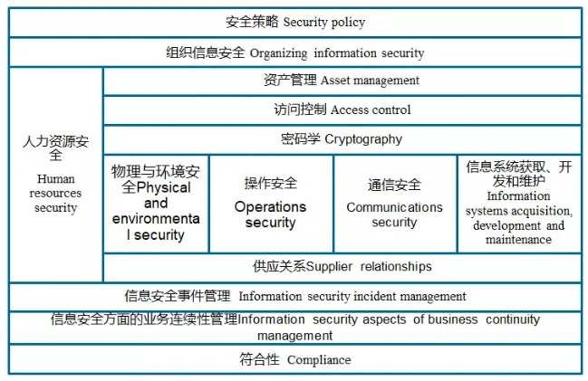

信息安全管理体系 (ISMS) 是一种通过实施组织内政策、过程、技术和人员来保护信息安全的系统。ISMS 的作用是识别和评估信息安全风险，并采取措施来管理和控制这些风险。

## 信息安全管理体系价值 

●遵循法规和法律要求，如数据保护和隐私法规。

●保护敏感数据，防止信息泄露、篡改或遗失。

●提高客户和合作伙伴的信任，提高企业声誉和形象。

●防范和减少网络安全威胁对组织造成的损害。

## 信息安全管理体系建设 

1前期评估：对企业的信息安全现状进行评估，了解信息安全需求和风险情况。

2制定信息安全政策：制定信息安全政策，确定信息安全目标和责任。

3设计信息安全体系：根据评估结果和政策，设计信息安全管理体系的组织结构和流程。

4建设信息安全体系：实施信息安全管理体系的建设计划，完善信息安全管理制度。

5检测评估：对信息安全管理体系进行评估和检测，确保信息安全管理体系的有效性。

6完善改进：根据评估结果，不断完善信息安全管理体系。

7维护管理：维护信息安全管理体系，确保信息安全管理体系的长期可持续运行。

## 信息安全管理体系控制域 

1信息安全方针：设立关于信息安全的政策和责任，以确保组织的目标和所有人的利益得到充分的保护。

2信息安全组织：确定并组织负责实施信息安全的管理层、员工以及其他相关人员。

3人力资源安全：要求在雇用、培训、开展业务活动和离职时保护员工、其他人员和组织的信息安全。

4资产管理：确定、识别、评估、监督和保护组织资产，以确保它们的完整性、可靠性、机密性和可用性。

5访问控制：确定访问权限规则，以限制对信息系统和数据的不合法访问。

6加密技术：使用加密技术来保护信息的机密性和完整性。

7物理和环境安全：使用物理和环境安全措施，以防止对信息系统和数据的未经授权的访问、损坏和更改。

8操作安全：确保组织的信息系统的日常操作，在安全的环境中运行。

9通信安全：保护传递的信息，安全传输到目的地。

10系统的获取和开发维护：对信息系统的获取、开发、安装和维护，确保其安全和符合标准。

11供应商关系：与其他公司的关系，确保信息安全不受其他公司的行为影响。

12信息安全事件管理：如何发现、报告、处理和预防信息安全事件。

13业务连续性管理：准备和应对灾难和其他不利影响，以确保业务可以继续运营。

14符合性：确保信息安全符合遵守了相关的法律、法规和标准要求。

## 信息安全管理体系 PDCA 过程 

PDCA 是一种实现组织的连续改进循环过程，使组织可以不断地提高效率和质量。PDCA 由以下四个阶段组成：

### 计划 (Plan): 

●制定目标，确定执行计划。规划(建立ISMS):建立与管理风险和改进信息安全有关的ISMS 方针、目标过程和规程，以提供与组织总方针和总目标相一致的结果。

○P1 定义ISMS范围和边界。

○P2 制定ISMS 方针。

○P3 确定风险评估方法。

○P4 实施风险评估。

○P5 选择、评价和确定风险处理方式、处理目标和处理措施。

○P6 获得管理者对建议的残余风险的批准。

○P7 获得管理者对实施和运行ISMS 的授权。

○P8 编制适用性声明 (SoA)。

### 执行 (Do)  

●实施计划，并且进行必要的变更。实施(实施和运行ISMS): 实施和运行ISMS 方针、控制措施、过程和规程。

○D1 制订风险处理计划。

○D2 实施风险处理计划。

○D3 开发有效性测量程序。

○D4 实施培训和意识教育计划。

○D5 管理ISMS 的运行。

○D6 管理ISMS 的资源。

○D7 执行检测和响应事件的程序。

### 检查 (Check) 

●评估计划的执行情况，评估结果。检查(监视和评审 ISMS): 对照ISMS 方针、目标和实践经验，评估并在适当时测量过程的执行情况，并将结果报告管理者以供评审。

○C1 日常监视和检查。

○C2 进行有效性测量

○C3 实施内部审核。

○C4 实施风险再评估。

○C5 实施管理评审。

### 改进 (Act) 

●根据结果，进行相应的改进，并确定未来计划。(4)处置(保持和改进ISMS):基于ISMS 内部审核和管理评审的结果或其他相关信息，采取纠正和预防措施，以持续改进 ISMS。

○A1 实施纠正和预防措施。

○A2 沟通措施和改进情况。