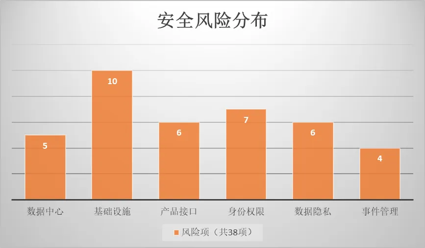
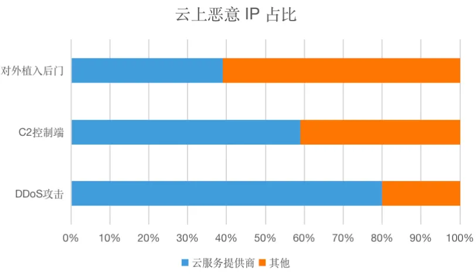

## 云平台重大安全风险评估报告 

### 一、概述 

为提升云平台安全竞争力，识别防范重大安全风险发生。从数据中心安全、基础设施与虚拟化安全、应用程序与接口安全、身份认证鉴权审计与访问控制、数据安全与信息生命周期管理、应用响应与安全事件管理，六大方面进行综合分析，为安全决策提供有效依据。

### 二、标准依据 

·        GB/T 20984-2007 《信息安全技术信息安全风险评估规范》

·        GB/T 22239-2019 《信息安全技术信息系统安全等级保护基本要求》

·        ISO/IEC 27001:2005 《信息安全技术信息安全管理体系要求》

·        ISO/IEC 27002:2005 《信息安全技术信息安全管理实用规则》

·        《CSA云计算关键领域安全指南》

·        《CSA云安全控制矩阵CCM》

·        《CSA云计算安全技术要求》

·        结合云安全治理运营的实际安全评估经验

### 三、风险分布 

### 四、数据中心安全 

| 风险项目                                                     | 风险描述                                                     |
| ------------------------------------------------------------ | ------------------------------------------------------------ |
| 完整的关键业务资产清单                                       | 必须按照对业务的关键程度、服务级别期望和运营连续性的要求对资产进行分类。应针对所有场所和区域的资产以及它们的用途，维护一份完整的关键业务资产清单，保持定期的更新，并按照定义的角色和职责来分配责任人 |
| 缺乏严格的资产统一管理流程                                   | 服务器对应资产负责人信息缺失，不能直接定位到归属，负责人变更同步 有外网权限的机器，绑定的VIP未及时更新，该收回的未及时回收 |
| 缺乏资产统一管理平台：网络资产、主机资产、应用资产、数据资产 | 特权设备管理：如直接NAT到外网的机器、有外网访问权限的机器、跳板机集中控制机，或者有其他特殊权限的机器 设备用途管理：网络设备、负载均衡、容器集群、数据库、大数据、云存储、云计算、云网络 应急和处理安全问题带来较大沟通成本（如：每次排查和应急都需要发一批业务方和一群运维同事自己去【认领】机器） |
| 业务部署公有云上，资产分类不清晰                             | 业务部署在公有云上，在资产平台显示的IP就为公用云租户，不能准确定位机器是租户还是内部业务与业务归属 |
| 设备识别与保护，应使用自动设备识别，认证授权后接入网络连接   | 发生过外部设备供应商和服务提供商的PC设备接入内网后，由于外部PC中毒在内网传播病毒 |

### 五、基础设施与虚拟化安全 

| 风险项目                                                     | 风险描述                                                     |
| ------------------------------------------------------------ | ------------------------------------------------------------ |
| 应实施技术措施和深度防御技术，检测并及时阻断出入站异常流量和网络攻击 | 网络出口被流量攻击打满阻塞，调研运营商阻断流量攻击 部署分布式拒绝服务（DDoS）攻击防御系统，清洗流量 部署入侵检测防御系统，识别和阻断网络攻击 |
| 缺乏详细的边界网络隔离策略，严格的网络变更流程，持续监控机制。 | 访问控制列表梳理困难，大量历史遗留规则 无法新加规则，规则数量已满 边界端口变更，安全隔离失效 IDC 及 CDN 服务器外网开放高危端口及高危服务 集团私有云、公有云（除租户）存在高危端口对外网开放，可能造成黑客利用漏洞绕过公司边界防护直接入侵内网 |
| 各业务网络开放策略没有书面说明所允许的服务                   | 多种的业务类型，不同安全等级，复杂的安全策略，共用网络入口（租户策略、平台策略、CDN策略、抗D策略、LB策略、Nat策略、独立IP策略） |
| 缺乏详细的内部网络隔离策略，严格的网络变更流程，持续监控机制。 | 办公网与 IDC 缺少网络安全域隔离，任一方风险可能横向扩散 IDC 内管理网未与生产网隔离，访问认证弱，且存在诸多绕过 IDC 内第三方业务服务器、测试服务器、windows服务器未与在线业务隔离 数据系统未严格与其他系统隔离 托管网络隔离措施Vlan评估 |
| 缺乏详细的虚拟网络隔离策略，严格的网络变更流程，持续监控机制。 | 应设计并配置网络环境和虚拟机实例，以限制和监控可信与不可信通信中的流量。应至少每年对这些配置进行一次评审，书面说明所有允许的服务、协议和端口的使用理由，并建立补偿性控制措施。 |
| 网络设备/物理主机/虚机/容器/数据库/中间件，操作系统加固和基础控制措施 | 应对每个操作系统进行加固，以提供业务必需的端口、协议和服务，并落实技术控制措施，如：杀毒软件、文件完整性监控、日志记录等，这些可以作为其运行构建的基线标准或模板的一部分 |
| 所有主机未统一接入主机安全软件保护                           | IDC 主机存在 SSH 弱认证风险 IDC 主机缺少恶意代码检测和防护能力，不能发现病毒木马 IDC 主机反弹 shell 无法监控发现 IDC 主机服务器漏洞缺乏发现 IDC 主机日志未集中收集 IDC 主机对进程、重要配置文件缺少防护，可能被篡改或删除 |
| CPU/Kernel/Hypervisor漏洞缺少热补丁机制                      | 底层系统漏洞需要重新修复，会导致业务中断。 需要具备热补丁/热迁移技术 |
| 虚拟机安全加固                                               | 时刻确保所有虚拟机镜像的完整性 确保安全漏洞评估工具或服务适应当前使用的虚拟化技术 |
| 虚拟机监控器安全加固                                         | 访问虚拟机监控器的管理功能或宿主系统的管理控制台时，应基于最小权限原则限制人员访问，并采用技术控制措施（如：双因素认证、审计追踪、IP 地址过滤、防火墙、TLS 协议和管理控制台通信） |

### 六、应用程序和接口安全 

| 风险项目                                                    | 风险描述                                                     |
| ----------------------------------------------------------- | ------------------------------------------------------------ |
| 对公网应用（包括测试系统、演示系统），未全部接入WAF安全防护 | 对公网应用，未部署防护措施，造成存在漏洞的应用系统被成功上线，进而造成线上存在有漏洞的系统 |
| 所有应用上线未全部进行SDL检测                               | 因缺乏安全流程或卡点、不遵守安全流程或卡点，造成存在漏洞的应用系统被成功上线，进而造成线上存在有漏洞的系统 |
| APP安全统一管理                                             | 因缺乏安全流程或卡点，APP发布没有通过阿凡达平台统一发布      |
| 大量应用存在无认证、越权访问、无审批、无审计等安全问题      | 因应用系统未实现身份认证，或使用自研身份认证体系而认证存在缺陷被攻破，造成线上应用存在认证凭证被盗用或未授权访问等漏洞 因应用系统缺乏对用户、资源（含数据）、操作的权限鉴别和控制，或设计及实现不当，造成线上应用存在越权访问漏洞 因应用系统缺乏账号及权限管理功能、权限申请审批、权限定期审计等，造成线上应用存在不恰当用户的问题 |
| 第三方开源应用、框架、组件安全风险                          | 因应用系统 使用了第三方开源应用、框架、组件实现，而此类应用、框架、组件被爆出安全漏洞，进而造成上层业务应用也存在安全漏洞 |
| 应用系统自建账号体系风险                                    | 缺少密码复杂度策略，密码定期更换，强制修改初始密码策略 缺少多次登录失败后的处理机制，可尝试暴力破解 外网自建账号体系系统缺少对系统账号的风险行为监控 外网自建账号采用单一密码认证，容易被破解 |

### 七、      身份认证鉴权审计与访问控制 

| 风险项目                 | 风险描述                                                     |
| ------------------------ | ------------------------------------------------------------ |
| 基础设施认证脆弱点       | 主机存在远程管理弱口令，批量主机使用相同账号密码 通过堡垒机远程管理主机，但可通过测试网绕过堡垒机直接登录主机 主机普遍存在内网信任关系，可通过1台主机作为跳板2次登录其他主机 网络设备未通过堡垒机管理，认证授权、操作审计方式未进行调研 主机、基础服务（如mysql）的账号密码明文存储在cf上，且未设置权限，造成账号持续泄漏 |
| 缺乏统一账号权限系统     | 目前Erp系统做为统一账号身份系统，但是权限系统都是自建的，人员异动权限无法及时更新，权限审计困难 |
| 堡垒机使用和管理风险     | 堡垒机权限管理较差，堡垒机未设置专用审计权限账户，系统日志审计差 堡垒机缺少精确到自然人的操作日志审计 堡垒机密码策略不完善，均未设置登录失败处理和账户锁定时间等策略 |
| 特权账号管理风险         | 超级管理员/Root/大Key权限管理 系统化、流程化、规范化落地特权帐号的管理工作 |
| 日志保护制度不明确       | 需建立对审计日志保护、保留和生命周期管理的高级别保证机制，以符合适用的法律法规和强制性义务，确保提供用户访问的唯一可追溯能力，以检测潜在的可疑网络行为和/或文件完整性异常，并提供在安全违规的情况下的取证调查能力。 |
| 日志审计缺失风险         | 堡垒机日志未进行统一管理，缺少定期的操作审计 数据库未进行日志记录功能 网络设备未进行操作行为日志记录 |
| 日志远程集中存储缺失风险 | 主机、WEB服务日志保存本地，且保留时间过短 日志信息中包含敏感信息， 未对日志信息进行脱敏处理。 应用系统没有用户行为操作日志 大量业务的业务日志、应用日志、主机日志等缺乏记录、缺少字段、存储时长较短，造成违背网络安全法的有关事件溯源追查等相关要求。 日志风险，没有全部收集集中存储 |

### 八、      数据安全与信息生命周期管理 

| 风险项目                           | 风险描述                                                     |
| ---------------------------------- | ------------------------------------------------------------ |
| 缺少数据目录                       | 搜寻并详细列记整个组织的数据资产。                           |
| 缺少数据分类                       | 应由数据责任人基于数据类型、数据值和对于组织的敏感程度、关键程度，对数据和包含数据的对象进行分类。 |
| 数据责任人/管理者责任              | 所有数据的管理工作应被定义，并以文件化形式定义和传达被分配的职责。 |
| 重要数据库集中存储与加密未有效管控 | 应建立策略和规程，并实施支持性业务流程和技术手段，按照适用的法律、法规和合规性义务，以保护敏感数据的存储（如文件服务器、数据库、终端用户工作站）、使用（内存中数据）、传输（如系统交互、跨越公共网络和电子消息） |
| 数据访问鉴权和监控审计未有效管控   | 运营后台，数据没有脱敏处理，没有进行操作审计 人员变动，访问权限变更不及时 |
| 数据库系统/大数据系统保护策略缺失  | 重要数据库系统，没有进程数据库审计 DMS数据库查询系统，权限限制不明确 |

### 九、      应急响应与安全事件管理 

| 风险项目                                                     | 风险描述                                                     |
| ------------------------------------------------------------ | ------------------------------------------------------------ |
| 针对各类安全威胁结合本部门业务情况，制定切实有效的应急预案，并定期对其进行更新 | 预案中应至少包含以下部分： 1）严重、高危web漏洞、业务逻辑漏洞、通用漏洞响应与修复 2）信息泄露事件分析、定位与止损 3）拒绝服务攻击响应 业务应用所依赖的通用框架、组件和服务、数据库等，出现重大0day需要紧急修复 预案中应明确RTO、RPO、响应流程、处理方法、主要负责人等信息； |
| 应急响应预案并定期演练                                       | 针对应用面临的主要威胁制定应急响应预案并开展贴近真实场景的演练。 定期组织贴近真实情况的演练，提高本部门员工在安全方面的应急响应能力。 |
| 事件响应度量指标                                             | 风险资产批量综合定位时间长 安全能力检测与防御时间，IoC、IDS、WAF规则，上线时间较长 |
| 事件止损措施缺乏                                             | 出方向，网络止损隔离时间较长，网络东西向隔离措施缺乏 批量恶意程序检测和杀毒能力缺乏，单机隔离措施缺乏 |

## 云计算服务滥用安全防范 

### 一、背景 

云计算服务因易获取、低成本、可靠性等优势，使得越来越多的个人、企业选择使用云服务，由于注册验证过程不严格、促销或免费试用、错误的配置和漏洞等原因，导致云资源被恶意攻击者滥用，网络安全法的出台以及各行业标准的要求，云运营商需要对服务滥用的行为进行识别和阻断。

### 二、云服务滥用原因 

●云服务不安全部署：身份密码的泄漏、系统或应用漏洞、身份劫持。

●利用云服务身份验证漏洞，从事非法活动：伪造、冒用他人身份注册并获取服务。

●支付漏洞，促销、免费试用活动具有漏洞，黑产从业者抢购大量廉价云计算资源。

### 三、云服务滥用行为 

常见的滥用行为包括：

●分布式拒绝服务攻击（DDoS）

●违法内容传播（黄反赌毒暴恐政）

●远程暴力破解（RDP、SSH、Mysql、FTP、Web）

●恶意软件，木马传播

●数字货币挖矿采矿

●电子邮件垃圾邮件

●网络钓鱼攻击活动

CNCERT 的抽样监测结果显示：

●针对境内目标 IP 的 DDoS 攻击中 80.1%的攻击来源为国内云服务提供商；

●C2 远程控制端 IP 中约 59%为国内云服务提供商 IP；

●对外植入网站后门的 IP 中约 39.4%的境内 IP 来源于国内云服务提供商；

### 四、做好安全防范，抵御恶意攻击 

1. 杜绝弱口令，弱口令是最容易出现的也是最容易被利用的漏洞。

2. 为所有服务配置强密码，要求至少 8 个字符以上，包含大小写字母、数字、特殊符号，并且要不定时更新口令。

3. Web 应用系统，必须使用强密码安全策略和验证码，防止暴力破解和撞库。

4. 数据库系统（Redis、MongoDB、MySQL、MSsql Server）禁止使用弱密码或无密码。

5. 增强安全策略，使用多因素验证机制（MFA）、强制密码安全策略（如：锁定策略），和审计功能（异常告警）。

6. 使用虚拟专有网络（VPC），隔离企业内部不同安全级别的云主机，避免同网络环境下一台服务器被入侵后影响到其它云主机。

7. 在 VPC 中使用 NAT 提供上网服务，禁止云主机直接绑定公网 IP，直接绑定公网 IP 会导致云主机完全暴露在互联网遭受攻击入侵。

8. 对互联网提供服务，通过负载均衡（LB）将需要开放对外的端口（如：80，443）代理到后端的应用服务，并将对外服务放置在独立的子网中。

9. 防火墙隔离（安全组）是云上的主要网络安全隔离手段，通过安全组设置在网络层过滤服务器的访问行为，限定服务器对外/对内的的端口访问，授权访问地址，从而减少攻击面，保护服务器的安全。

10. 高危网络端口，开启的服务端口越多越不安全。只对外开放提供服务的必要端口，禁止将 RDP、SSH、Redis、MongoDB、MySQL、MSsql 等高危服务直接暴露在互联网上。