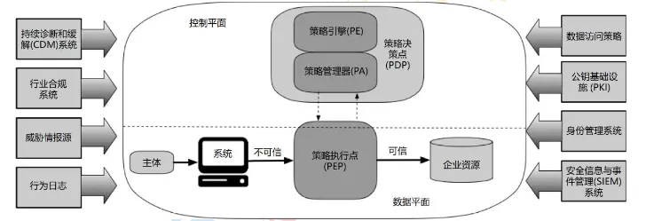

## 背景 

过去企业会将防御重点放在使用防火墙和VPN保护网络访问上，并假设网络内部的一切都是安全的。但是今天，随着云或远程办公的发展，网络安全威胁日益增加，企业需要更高效、更安全的网络安全架构保护企业安全。

零信任架构关注于保护资源、而非网络分段，因为网络位置不再被视为资源安全态势的主要组成部分。企业不应自动信任内部或外部的任何人/事/物、不应该根据物理或网络位置对系统授予完全可信的权限，应在授权前对任何试图接入企业系统的人/事/物进行验证、对数据资源的访问只有当资源需要的时候才授予。

●2010年：零信任安全最早由 Forrester 的首席分析师约翰.金德维( John Kindervag )提出。

●从2014年：Google 发表了6篇 BeyondCorp 相关的论文，全面介绍 BeyondCorp 架构和实施情况。

●2017年：业界厂商大力跟进，包括思科、微软、亚马逊等。

●2018年至今：中央部委、国家机关、中大型企业开始探索实践零信任安全架构。

## 零信任概念 

零信任是一种网络安全理念，通过降低对网络中的所有实体的信任，来增强网络安全。它认为任何网络实体，无论是内部或外部的，都不应被自动信任，并且应该经过验证和授权才能访问网络上的数据和资源。

零信任安全架构的使用是为了抵御新兴的网络安全威胁，如黑客、恶意软件等。随着网络技术的发展，网络安全威胁也在不断变得复杂。零信任安全架构通过在网络的各个层面降低信任，以确保网络的安全。

## 零信任核心原则 

在《零信任网络》一书中，埃文.吉尔曼（Evan Gilman）和道格.巴斯(Doug Barth)将零信任的定义建立在如下五个基本假定之上：

1网络无时无刻不处于危险的环境中。

2网络中自始至终存在外部或内部威胁。

3网络的位置不足以决定网络的可信程度。

4所有的设备、用户和网络流量都应当经过认证和授权。

5安全策略必须是动态的，并基于尽可能多的数据源计算而来

## 零信任总体框架 

美国国家标准与技术研究院NIST特别出版物 SP800-207《零信任架构》定义的零信任体系架构，通过增强的认证和授权机制来保护网络。它强制执行“零信任”原则，不管用户或资源在物理位置上如何，所有请求都必须经过认证和授权。对于任何请求，都必须在执行之前证明该请求是从可信资源发出的，并且该请求操作是合法的。

零信任架构使用多重安全控制，包括静态和动态身份验证、策略管理、安全管理和威胁情报，以确保安全。它还要求实现对网络流量的可见性和控制，以确保任何未经授权的活动都能被检测和阻止。

### 零信任安全架构构建 

零信任安全架构的实现过程中，需要通过多种手段来确保安全，如：

1身份包括网路、设备、用户、应用等，通过对身份进行验证来构建访问控制体系而非网络位置；

2默认所有的访问都是不安全的，所以所有的资源都应该受安全保护，而不是只保护一部分资源；

3资源按照当前身份执行任务的最小需求分配；

4零信任的发展离不开大数据的发展，正因为有足够的多源数据能够进行计算分析，授权才能真正从静态发展为动态；

5最终进行授权决策的时候，应该根据身份信息、权限信息和评估出来的信任等级形成动态的控制策略去控制访问的准入。

## 零信任关键技术 

### 身份管理系统 

●身份标识：识别访问系统的个体，以便识别用户身份。

●身份验证：确认访问系统的个体是否是所认识的用户，以确认用户身份。

●授权：根据确认的用户身份，决定用户是否具有访问系统的权限。

●可问责性：跟踪和记录用户对信息系统、应用程序或数据的访问，以便在需要时追查责任。

### 访问控制引擎 

●DAC (Discretionary Access Control)：自主访问控制：用户自行决定是否具有访问系统的权限。

●MAC (Mandatory Access Control)：强制访问控制：系统管理员决定用户是否具有访问系统的权限。

●RBAC (Role-Based Access Control)：基于角色的访问控制：根据用户的角色决定用户是否具有访问系统的权限。

●ABAC (Attribute-Based Access Control)：基于属性的访问控：根据用户的属性，如用户所在的组织机构或用户的职务，决定用户是否具有访问系统的权限。

### 访问代理网关 

软件定义边界，通过软件的方式，为企业构建起虚拟边界，利用基于身份的访问控制以及完备的权限认证机制，为企业应用和服务提供隐身保护，使网络黑客看不到目标而无法对企业的资源发动攻击，有效保护企业的数据安全。SDP 具有以下特点：

●网络隐身：没有对外暴露的 DNS、IP 地址或端口，必须通过授权的SDP客户端使用专有的协议才能进行连接，攻击者无法获取攻击目标。

●预验证：用户和终端在连接服务器前必须提前进行验证，确保用户和设备的合法性。

●预授权：依据最小权限原则，在设备接入前授予完成任务所需的应用和最小访问行为权限。

●应用级的访问准入：用户只有应用层的访问权限，理论上无法获取服务器的配置、网络拓扑等其他信息，无法进行网络级访问。

- https://csrc.nist.gov/csrc/media/publications/sp/800-162/final/documents/sp800_162_draft.pdf

